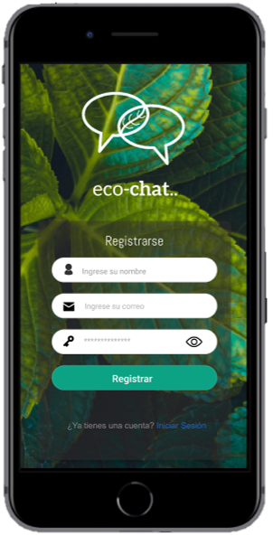
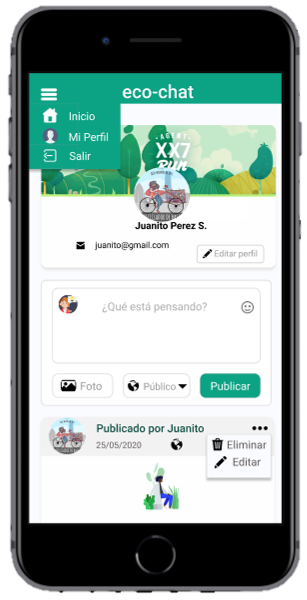
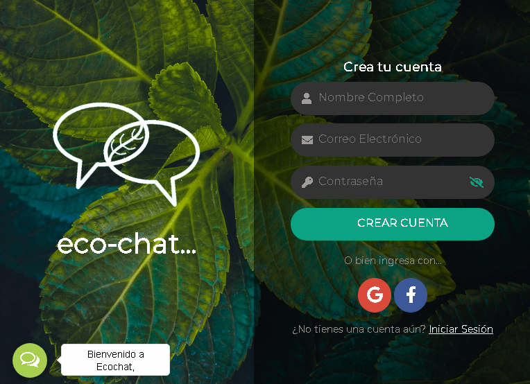
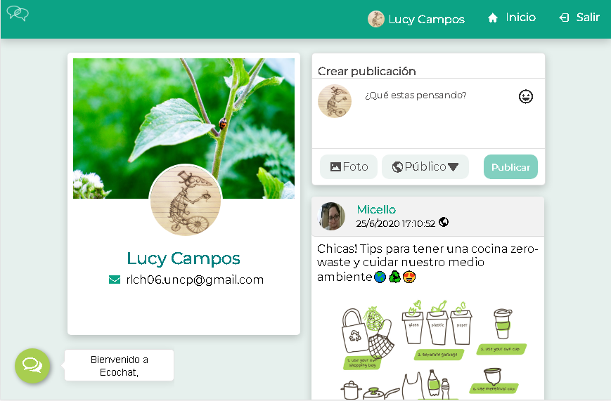

# 🌎 **ECO-CHAT** ♻️

Eco-chat es una red social dirigida a la población en general especialmente a los ambientalistas, en el cual los usuarios pueden escribir, leer, actualizar y eliminar datos por ejemplo: eventos, proyectos, memes, tips de reciclaje, manualidades a través de productos reciclados, entre otras cosas que sean relacionadas al cuidado del medio ambiente. También permite interactuar entre los usuarios mediante los comentarios.Y de esta manera através de Ecochat podremos aportar con un granito de arena al cuidado del medio ambiente.

# DISEÑO DEL INTERFAZ DE USUARIO
## **PROTOTIPO - Vista Mobile:**
👉[Prototipo en Figma - Mobile](https://www.figma.com/proto/bWVDAmBU9CXQ1AniODKobo/Red-social-Colors-(Copy)?node-id=24%3A18&viewport=13%2C387%2C1.3694857358932495&scaling=scale-down)

## **PROTOTIPO - Vista Desktop:**
👉[Prototipo en Figma - Desktop](https://www.figma.com/proto/bWVDAmBU9CXQ1AniODKobo/Red-social-Colors-(Copy)?node-id=174%3A2&viewport=178%2C267%2C0.3740507662296295&scaling=contain)

## **FUNCIONALIDAD**

Nuestros usuarios de Eco-chat en su primera versión, realizar las siguientes acciones:

- Crear una cuenta con un correo electrónico válido y una contraseña con más de 6 caracteres. Ya que al crear su cuenta, recibirá un mensaje de confirmación en el correo que haya ingresado para iniciar sesión.
- También puede loguearse através de su cuenta de Google y Facebook, con ello ya no sería necesario registrarse.
- Una vez que logre loguearse, podrá ver su perfil sin la necesidad de recargar la página. Si en caso el usuario ingresa por primera vez creando una cuenta; el perfil que observará será con un avatar y una foto de portada por defecto, ahora si el usuario se ha logueado con su cuenta de google o facebook observará su foto de perfil y nombre de usuario que tiene por defecto en su cuenta correspondiente. 
- Podrá editar su foto de perfil, la portada y su nombre de usuario como mejor le parezca.
- POSTS:
    - Podrá crear publicación de texto, imágenes de diferentes extensiones, agregar emojis, etc.
    - Podrá ver los post públicos que han creado hasta ese momento, desde el más reciente hasta el más antiguo, así como también tiene la opción de poder cambiar la configuración de privacidad de sus post ya sea PRIVADO o PÚBLICO.
    - Una vez que ya tiene la publicación podrá editar el contenido, como la privacidad y tambien tiene la   opción de eliminar el post.
    - Podrá dar y quitar like en el post que desee.
- COMENTARIOS:
    - Podrá escribir e insertar emojis que tiene disponible en el mismo cuadro de agregar comentario.
    - Tiene la opción de EDITAR y ELIMINAR.

## Objetivos de aprendizaje
### HTML y CSS

* [x] [HTML semántico](https://developer.mozilla.org/en-US/docs/Glossary/Semantics#Semantics_in_HTML)
* [x] [CSS `flexbox`](https://css-tricks.com/snippets/css/a-guide-to-flexbox/)
* [x] Construir tu aplicación respetando el diseño realizado (maquetación).

### DOM y Web APIs

* [x] [Manipulación dinámica del DOM](https://developer.mozilla.org/es/docs/Referencia_DOM_de_Gecko/Introducci%C3%B3n)
* [ ] [History API](https://developer.mozilla.org/es/docs/DOM/Manipulando_el_historial_del_navegador)
* [ ] [`localStorage`]

### Javascript

* [x] [Uso de callbacks](https://developer.mozilla.org/es/docs/Glossary/Callback_function)
* [x] [Consumo de Promesas](https://scotch.io/tutorials/javascript-promises-for-dummies#toc-consuming-promises)
* [x] Uso ES modules
([`import`](https://developer.mozilla.org/en-US/docs/Web/JavaScript/Reference/Statements/import)
| [`export`](https://developer.mozilla.org/en-US/docs/Web/JavaScript/Reference/Statements/export))

### Firebase

* [x] [Firestore](https://firebase.google.com/docs/firestore)
* [x] [Firebase Auth](https://firebase.google.com/docs/auth/web/start)
* [x] [Firebase security rules](https://firebase.google.com/docs/rules)
* [x] [Uso de onSnapshot](https://firebase.google.com/docs/firestore/query-data/listen)
| [onAuthStateChanged](https://firebase.google.com/docs/auth/web/start#set_an_authentication_state_observer_and_get_user_data)

### Testing

* [x] [Testeo de tus funciones](https://jestjs.io/docs/es-ES/getting-started)
* [ ] [Testeo asíncrono](https://jestjs.io/docs/es-ES/asynchronous)
* [ ] [Mocking](https://jestjs.io/docs/es-ES/manual-mocks)

### Colaboración en Github

* [x] Branches
* [x] Pull Requests
* [ ] Tags

### Organización en Github

* [ ] Projects
* [ ] Issues
* [ ] Labels
* [ ] Milestones

### Buenas prácticas de desarrollo

* [x] Modularización
* [x] Nomenclatura / Semántica
* [x] Linting

